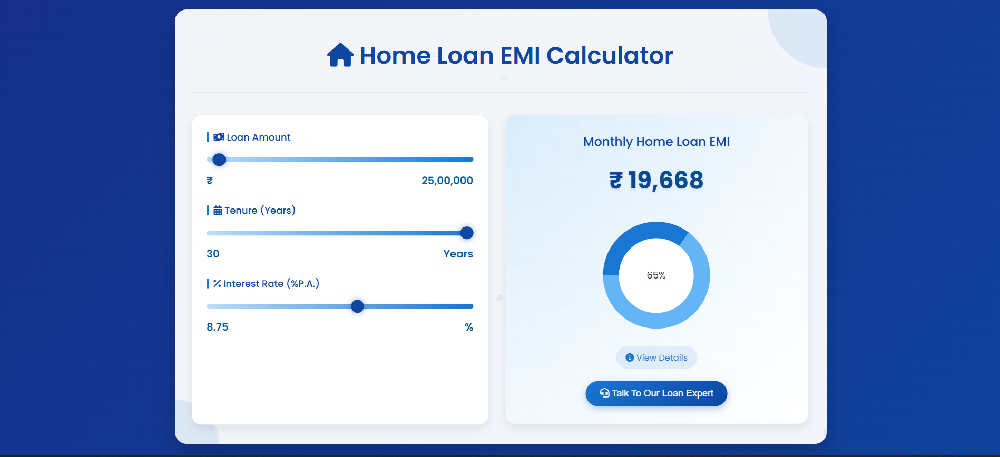

# Home Loan EMI Calculator

A beautiful, interactive web application that helps users calculate and visualize their home loan EMI (Equated Monthly Installment) based on loan amount, tenure, and interest rate.

![Home Loan EMI Calculator Screenshot]

## Features

- **Interactive Sliders**: Easily adjust loan amount, tenure, and interest rate with responsive sliders
- **Real-time Calculation**: Instantly see how changes affect your monthly payment
- **Visual Breakdown**: View the proportion of principal vs. interest in a visual chart
- **Detailed Information**: Get complete breakdown of principal amount, total interest, and total repayment
- **Responsive Design**: Works perfectly on all devices - desktops, tablets, and mobile phones
- **Beautiful Animations**: Smooth transitions and micro-interactions enhance user experience
- **Professional UI**: Bank-like interface with premium design elements

## Demo

Check out the live demo [here](https://finance-hub-nine.vercel.app/)

## Technical Details

### Technologies Used

- HTML5
- CSS3 (with animations and transitions)
- JavaScript (ES6+)
- Font Awesome (for icons)

### Core Functionality

The calculator uses the standard EMI formula:

```
EMI = P × r × (1 + r)^n / ((1 + r)^n - 1)
```

Where:
- P = Principal loan amount
- r = Monthly interest rate (annual rate ÷ 12 ÷ 100)
- n = Loan tenure in months

### Key UI Components

1. **Input Section**
   - Loan Amount: ₹100,000 to ₹100,000,000
   - Tenure: 1 to 30 years
   - Interest Rate: 0.5% to 15%

2. **Results Section**
   - Monthly EMI amount
   - Visual chart representation
   - Detailed breakdown (principal, interest, total)

3. **Interactive Elements**
   - Toggle-able details section
   - "Talk to Expert" button with animation
   - Floating financial icons background
   - Subtle parallax effects

## Installation and Setup

1. Clone this repository:
   ```
   git clone https://github.com/pravin431/FinanceHub.git
   ```

2. Open the project folder:
   ```
   cd home-loan-emi-calculator
   ```

## Customization

### Changing Default Values

Edit the JavaScript file (`script.js`) to modify default values:

```javascript
// Default values
const principal = 2500000;  // ₹25,00,000
const tenure = 30;          // 30 years
const interestRate = 8.75;  // 8.75%
```

### Styling

The application uses a custom CSS file (`style.css`) with variables for easy customization:

- Color scheme
- Font sizes
- Animations
- Layout dimensions

## Browser Compatibility

- Chrome 60+
- Firefox 60+
- Safari 12+
- Edge 79+
- Opera 47+

## Future Enhancements

- [ ] Add amortization schedule
- [ ] Implement prepayment options
- [ ] Export results as PDF
- [ ] Compare different loan options side by side
- [ ] Save calculations for later reference

## Credits

- Font Awesome for the icons
- Google Fonts for typography
- Inspiration from modern banking applications

## License

[MIT](LICENSE) - Feel free to use and modify for your projects

---
